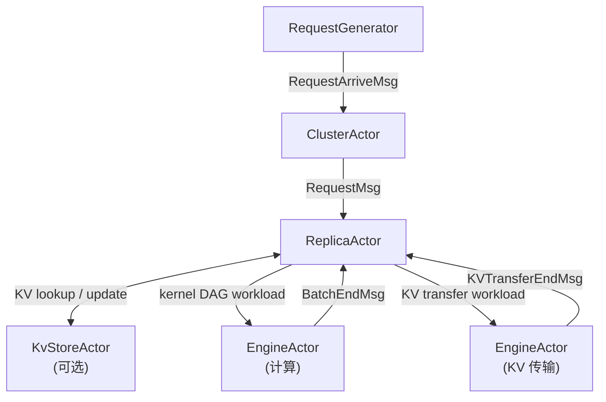
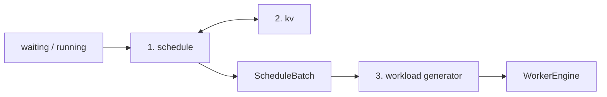

# hybridsim

hybridsim 的目标是**建立一个AI infra系统的孪生仿真**，辅助 infra 的开发与设计验证。

## 1. 设计原则

仿真在追求两个设计目标：

### 端到端系统仿真

infra系统的各组件相互耦合——调度、KV、传输、计算时序会共同决定端到端行为。若只做局部仿真，往往无法复现跨层依赖引发的复杂问题。现有 AI 仿真器多聚焦单点（仅算子、仅网络、仅调度等），难以覆盖完整 serving 链路。

hybridsim 因此以**端到端**为首要目标：从请求到达、集群分发、实例调度与 KV，到 workload 生成与 Engine 执行，在同一 DES 时间轴上联合推演。

### 精度、效率、粒度的平衡


| 维度     | 含义           |
| ------ | ------------ |
| **精度** | 与真实系统行为一致    |
| **效率** | 仿真运行与迭代开发的成本 |
| **粒度** | 建模的细节程度      |


三者通常不可兼得。精度是硬约束；效率与粒度则按场景权衡。面向 infra 开发时，我们倾向于在**关注的子系统**上尽可能暴露细节（白盒、可调）。不关注的子系统上可以采用黑盒数据模型快速模拟。

### 解决方案：Actor + DES

为实现设计目标，hybridsim 采用**离散事件驱动（DES）的 Actor 基座**连接各子系统（设计见 docs/platform.md）：子系统之间只通过**消息接口**交互，实现逻辑解耦；DES 则让仿真时钟与子系统推进方式统一，便于按需调节粒度。


| 方式             | 适用        | 特点                                                                    |
| -------------- | --------- | --------------------------------------------------------------------- |
| **Data-based** | 不重点关注的子系统 | 用解析模型或 trace 直接给出结果（如 α-β 传输、Roofline 算时）；精度与效率较高，细节为黑箱               |
| **Mock-based** | 重点攻关的子系统  | 用可观测、可替换的白盒逻辑建模（如 vLLM 对齐的 scheduler、Mooncake 风格 KV 交互）；可控可调，便于对照真实实现 |


同一套框架下，可将不同层配置为不同粒度：例如调度与 KV 走 mock-based 细粒度交互，计算与 collective 可用 data-based 估时，也可替换为 Computing Platform / Network 细粒度仿真。

## 2. 整体实现

分为平台底座和推理仿真两个部分


| 层    | 包 / 目录                                                | 作用                                                                        |
| ---- | ----------------------------------------------------- | ------------------------------------------------------------------------- |
| 平台   | `hybridsim`（`src/hybridsim/`、`src/python/hybridsim/`） | DES Actor 运行时：`Simulation`、`ActorBase`、`EngineActor`、消息注册与 `run()`        |
| 推理仿真 | `hybridsim_infer`（`src/python/hybridsim_infer/`）      | 把 LLM serving 建模为 Cluster / Replica / KV / Engine 等 Actor，跑端到端推理 workload |


`hybridsim` 实现了DES-based actor仿真基座，同时也集成了一些C++层面的计算密集的Actor组件（见 [docs/platform.md](docs/platform.md)）

`hybridsim_infer` 把一个 serving 集群建模为：**请求注入 → 集群分发 → 实例内调度与 KV → workload 生成 → Engine 执行**。全景见 [docs/architecture.md](docs/architecture.md)。




**分层职责**（细节见各专题文档）：


| 分层     | 职责                                              | 文档                                                                                                        |
| ------ | ----------------------------------------------- | --------------------------------------------------------------------------------------------------------- |
| 请求生成   | 到达时刻、prefill/decode 长度、前缀共享                     | [request_generation.md](docs/request_generation.md)                                                       |
| 集群分发   | replica 间 least-load；`monolith` 或 PD 双池         | [scheduler.md](docs/scheduler.md)                                                                         |
| 实例内    | 每 step：`schedule` → `kv` → `workload generator` | [scheduler.md](docs/scheduler.md)、[kv.md](docs/kv.md)、[workload_generator.md](docs/workload_generator.md) |
| Engine | 按 kernel DAG 依赖推进仿真时钟                           | [engine.md](docs/engine.md)                                                                               |


Replica 内每 step 的数据流：




- **schedule**：token budget、并发、KV 容量 → `ScheduleBatch`
- **kv**：本地 prefix cache、远端 Store、PD 传输（见 [kv.md](docs/kv.md)）
- **workload generator**：`ScheduleBatch` → mock → Operator DAG → **Analyzer** → kernel DAG

**现状**：Engine 几乎只执行 `TimeoutKernel`（时长在 Analyzer / predictor 阶段估好）。目标是在其下接入 **Computing Platform**（GPU 细粒度仿真）与 **Network**（通信细粒度仿真），二者尚未实现。

### 仿真输入与输出

```python
from hybridsim_infer import InferenceConfig, build_inference_simulation

cfg = InferenceConfig()
infra = build_inference_simulation(cfg)
infra.schedule_from_generator(gen)  # 或 schedule_arrivals(requests)
infra.run()

print(infra.metrics())
infra.check_errors()
```


|         | 内容                                                                                                            |
| ------- | ------------------------------------------------------------------------------------------------------------- |
| **输入①** | `InferenceConfig`：集群、调度、KV、workload 估时、落盘开关 → [inference_config.md](docs/inference_config.md)                 |
| **输入②** | `InferenceRequest` / `RequestGenerator`：请求负载（build 之后注入）→ [request_generation.md](docs/request_generation.md) |
| **输出**  | `metrics()`、`finished_requests`、可选 `output.`* 文件 → [outputs.md](docs/outputs.md)                              |


### 典型 Demo：PD 2P+2D

[`examples/inference/pd_demo.py`](examples/inference/pd_demo.py) 跑一条完整 serving 链路：2 Prefill + 2 Decode、KV 传输、prefix cache、metrics 与 request profile。

```bash
PYTHONPATH=src/python:. python examples/inference/pd_demo.py
PYTHONPATH=src/python:. python examples/inference/pd_demo.py --input trace
PYTHONPATH=src/python:. python examples/inference/pd_demo.py --workload op
```

| | 说明 |
| --- | --- |
| **用法** | 上列命令；`--input handwritten\|trace`，`--workload batch\|op`。其它开关见 `--help`。 |
| **输入** | 配置：`cluster.type=pd`（2P+2D）、Store + prefix cache、`llama-3.1-8b`。请求：手写 6 条共享前缀，或 Mooncake KV trace 前 10 条。估时：`batch` 为 token 比例；`op` 为 mock DAG + Roofline（默认 TP=2）。 |
| **输出** | stdout 打印可读 metrics（TTFT / TPS / prefix hit）。Chrome Trace 默认 `profile/pd_demo.json`（其它组合带 `_input_workload` 后缀），用 `chrome://tracing` 或 [Perfetto](https://ui.perfetto.dev/) 打开。 |

单实例示例：[`examples/inference/monolithic_demo.py`](examples/inference/monolithic_demo.py)。Actor 基座示例在 [`examples/actors/`](examples/actors/)。


---


## 3. 安装说明


### 环境要求

- CMake ≥ 3.14
- C++20 编译器（GCC ≥ 10 / Clang ≥ 14）
- Git（构建时自动获取 `simcpp20`、`pybind11` 到 `third_party/`，已在 `.gitignore`）
- Python ≥ 3.10


### 推荐：pip 可编辑安装

```bash
pip install -e .
```

会经 CMake 编译 `hybridsim_py` 并安装 `hybridsim` / `hybridsim_infer`。若 pip 过旧，先升级：

```bash
python3 -m pip install -U 'pip>=24' setuptools wheel
```

隔离构建拉取 cmake 失败时可改用：

```bash
python3 -m pip install --no-build-isolation -e .
```

验证安装：

```bash
python3 examples/actors/actor_python_demo.py
PYTHONPATH=src/python:. python3 examples/inference/monolithic_demo.py
```

可选依赖（ServeGen 请求生成）：

```bash
pip install -e ".[servegen]"
```


### 仅 CMake（C++ / 开发调试）

```bash
cmake -B build
cmake --build build
ctest --test-dir build --output-on-failure
```

跳过 Python 绑定：

```bash
cmake -B build -DHYBRIDSIM_BUILD_PYTHON=OFF
cmake --build build
```

未 `pip install` 时，可用 `SimulationConfig(build_dir=Path("build"))` 或 `InferenceConfig(build_dir=...)` 指向 CMake 产物目录。


| CMake 选项                   | 默认  | 说明                |
| -------------------------- | --- | ----------------- |
| `HYBRIDSIM_BUILD_PYTHON`   | ON  | 构建 `hybridsim_py` |
| `HYBRIDSIM_BUILD_TESTS`    | ON  | 注册 CTest          |
| `HYBRIDSIM_BUILD_EXAMPLES` | ON  | 构建 C++ 示例         |


### 运行测试

```bash
python3 run_tests.py              # 平台 + Frontier 示例测试
python3 run_tests.py --platform-only
```

推理仿真相关测试（未安装包时加 `PYTHONPATH`）：

```bash
PYTHONPATH=src/python:. python3 tests/test_inference_skeleton.py -v
```

未安装 Frontier 时 Frontier 用例自动 skip；可用 `HYBRIDSIM_SKIP_FRONTIER_ALIGN=1` 跳过对齐测试。

### 网络问题

`git clone` 依赖失败时，可手动将 `simcpp20`、`pybind11` 放入 `third_party/`，或配置镜像后重试。