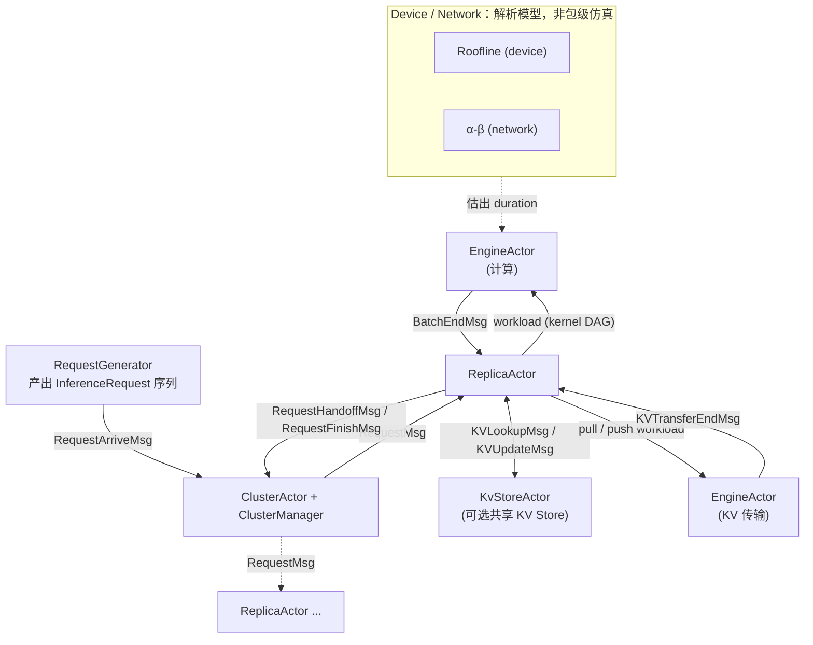
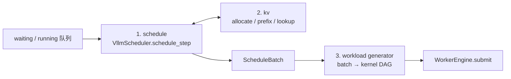

# hybridsim 推理仿真架构

`hybridsim_infer` 把一个 LLM serving 集群建模成一组 Actor：请求由生成器注入，经集群分发到实例，实例内做调度与 KV 管理，产出的 batch 被翻译成算子 DAG，交给离散事件 Engine「假执行」。

本文是总览，只回答「有哪几层、各层管什么、数据怎么流」。逐层细节在专题文档，见文末阅读顺序。

---

## 1. 全景



对照关系：

| 分层 | 代码 | 配置组 | 状态 |
|------|------|--------|------|
| 请求生成 | `hybridsim_infer.request_generators`（List / ServeGen / KV trace） | 不在 config，构建后注入 | 已实现 |
| 集群分发 | `ClusterActor` + `MonolithClusterManager` / `PdClusterManager` | `cluster`、`schedule.cluster` | monolith / PD + least-load 已实现 |
| 实例调度 | `ReplicaActor` + `VllmScheduler`（`SchedulerFactory`） | `schedule.replica` | vLLM 语义已实现并对齐 |
| KV | `VllmKvCacheManager`、`KvClient`、`KvStoreActor` | `kv`、`kv_workload` | 本地 APC + Store 骨架已实现 |
| 计时（batch → 时长） | `workload_generators`（`batch_level` / `op_level`） | `model`、`infer_workload` | 已实现 |
| Engine 执行 | `WorkerEngine` + C++ `engine_actor` | `schedule.engine` | kernel DAG 已实现 |
| Device / Network | `DeviceConfig` / `NetworkConfig`（解析公式） | `infer_workload.op`、`kv_workload` | 只有解析模型，无包级仿真 |

组装入口是 [`build_inference_simulation`](../src/python/hybridsim_infer/builder.py)：读一份嵌套 [`InferenceConfig`](../src/python/hybridsim_infer/config/__init__.py)，spawn 出 Cluster、N 个同构 Replica（各带 1 个计算 Engine，启用 Store 时再加 1 个传输 Engine）、可选的共享 Store，返回 `InferenceSimulation` 句柄。Actor 的配置输入一律是这份 `config`；`replica_id` / `cluster` / `engine` / `kv_store` 等是运行时接线，不再把扁平 knobs 拆进构造参数。

```python
from hybridsim_infer import InferenceConfig, build_inference_simulation

infra = build_inference_simulation(InferenceConfig())
infra.schedule_from_generator(gen)
infra.run()
```

---

## 2. 各层职责

### 2.1 请求生成

- **职责**：决定「什么时候来多少请求、每条多长、前缀怎么共享」。
- **输入 / 输出**：外部 trace 或分布参数 → `list[InferenceRequest]`（带 `arrived_at` / `num_prefill_tokens` / `num_decode_tokens` / 可选 `hash_ids`）。
- **入口**：`ListRequestGenerator`、`ServeGenRequestGenerator`、`KvCacheTraceRequestGenerator`；经 `infra.schedule_arrivals` 或 `schedule_from_generator` 注入。
- **不做**：不决定执行时长，也不进 `InferenceConfig`（构建之后再注入）。

详见 [request_generation.md](request_generation.md)。

### 2.2 集群分发

- **职责**：请求在实例之间怎么放。当前只有 least-load，一个策略两种拓扑。
- **输入 / 输出**：`RequestArriveMsg` / `RequestHandoffMsg` / `RequestFinishMsg` → 向目标 replica 发 `RequestMsg`。
- **入口**：[`actors/cluster.py`](../src/python/hybridsim_infer/actors/cluster.py)、[`cluster/`](../src/python/hybridsim_infer/cluster/)。

两种拓扑：

| `cluster.type` | 到达时选谁 | 请求上盖的标志 |
|----------------|------------|----------------|
| `monolith` | 全部 replica 里 least-load | 清掉 PD 标志 |
| `pd` | Prefill 池 least-load | `do_remote_decode=True`；prefill 算完后 handoff 再从 Decode 池选一台，盖 `do_remote_prefill` + `remote_replica_id=源 P` |

关键约定：**Replica 是同构的**，没有「P 实例代码路径」和「D 实例代码路径」，角色只体现在请求的 `kv_transfer_params` 上。PD 的 handoff 由 `ReplicaActor._maybe_handoff_prefill` 触发，Decode 侧 `num_computed_tokens` 清零后重新拉 KV。

- **不做**：AF（Attention / FFN）分离等其它实例间拓扑尚未实现；第二种分发策略（`schedule.cluster.policy` 只接受 `least_load`）也未实现。

### 2.3 实例内部

一台 replica 每拍做三件事，对应框架图里 replica 的三个过程：



1. **schedule**：在 token budget、并发上限、KV 容量三重约束下，决定本步哪些请求各算多少 token，产出 `ScheduleBatch`。抢占按 vLLM 的 FCFS 语义。
2. **kv**：调度过程中触发。本地 `allocate` / prefix 命中直接抬高 `num_computed_tokens`；命中远端时排队 pull，请求进入 `WAIT_FOR_REMOTE_KVS`，等 `KVTransferEndMsg` 解锁。
3. **workload generator**：把 `ScheduleBatch` 变成 Engine 能跑的 kernel DAG（`batch_level` 一个 kernel，`op_level` 一整张算子图）。

- **输入 / 输出**：`RequestMsg` / `StepMsg` / `BatchEndMsg` / `KVTransferEndMsg` / `KVLookupReplyMsg` → workload、`RequestFinishMsg`、`RequestHandoffMsg`。
- **入口**：[`actors/replica.py`](../src/python/hybridsim_infer/actors/replica.py)、[`schedulers/vllm_schedule.py`](../src/python/hybridsim_infer/schedulers/vllm_schedule.py)。
- **不做**：不感知自己是 P 还是 D；不自己估时长（交给 workload generator）。

步进循环是事件驱动的：`_arm_step` 保证同一时刻最多一个待处理 `StepMsg`，Worker 满了就等 `BatchEndMsg` 唤醒，而不是固定周期轮询。

详见 [scheduler.md](scheduler.md)、[kv.md](kv.md)。

### 2.4 Engine

- **职责**：按依赖关系执行 kernel DAG，推进仿真时钟。
- **输入 / 输出**：workload（kernel 列表 + 依赖）→ 完成回调 → `BatchEndMsg` / `KVTransferEndMsg`。
- **入口**：[`actors/worker_engine.py`](../src/python/hybridsim_infer/actors/worker_engine.py)、[`engine/engine_actor.hpp`](../src/hybridsim/engine/engine_actor.hpp)。
- **不做**：不估时长。当前唯一 kernel 实现是 `TimeoutKernel`，只 `co_await sim.timeout(duration)`。

详见 [engine.md](engine.md)。

### 2.5 Device / Network

框架图把细粒度仿真（拥塞、QoS、CC、算通 overlap）画在最底层。**当前实现里它们是解析公式，不是独立仿真器**：

- 计算：Roofline（`DeviceConfig.peak_flops` / `hbm_bandwidth_bps` + 利用率）
- 通信：α-β（`NetworkConfig.alpha_s` / `beta_s_per_byte`）
- KV 传输：同一套 α-β，参数走 `kv_workload`

时长在 workload generator 阶段就算完了，Engine 只是把它「等」出来。所以现阶段能反映**排队、并发、KV 容量、前缀命中**对端到端时延的影响，不能反映链路级拥塞。

---

## 3. 一次请求的生命周期

**Monolith**：

```text
arrived_at 到点 → ClusterActor.on_request_arrive → least-load 选 replica → RequestMsg
  → ReplicaActor.on_request：入 waiting，_arm_step
  → on_step：schedule_step 产出 ScheduleBatch（可能只是 prompt 的一个 chunk）
  → workload generator → WorkerEngine.submit → EngineActor 跑 kernel DAG
  → BatchEndMsg → on_batch_complete：推进 computed / output token
      ├─ 未完成 → 继续下一拍
      └─ 完成 → 释放 KV → RequestFinishMsg → Cluster 记账
```

**PD 分离**多两段：prefill 侧算完 prompt 后不继续 decode，而是发 `RequestHandoffMsg`；Cluster 从 Decode 池选一台重发 `RequestMsg`；Decode 侧先走控制面 lookup + KV pull（`WAIT_FOR_REMOTE_KVS`），KV 到齐后才开始 decode。开启 prefix caching 时，Prefill 在 handoff 前会把已算前缀发布到本地 APC，供同 prompt 的后续请求命中。

---

## 4. 平台底座

推理逻辑全在 Python，DES 内核在 C++：

- [`Simulation`](../src/python/hybridsim/simulation.py)：持有 simcpp20 仿真器，`spawn_actor` / `create_engine_actor` / `register_messages` / `run`。
- `ActorBase` + `@on(Msg)`：Python 侧 Actor 基类，`send` / `send_at` / `request` 对应 DES 事件投递；handler 可以是 `async def`，挂起的是协程而非线程。
- `engine_actor`（C++）：收到 `WorkloadMsg` 后按依赖跑 kernel，完成发 `WorkloadDoneMsg`。

推理侧的消息表在 [`messages.py`](../src/python/hybridsim_infer/messages.py)，`build_inference_simulation` 里统一 `register_messages(INFER_MESSAGE_TYPES)`。

平台本身的构建、C++ API、Frontier 复现见仓库根 [README.md](../README.md)。

---

## 5. 现状边界

写清楚哪些是「已经在跑的」，哪些只是框架图上的位置：

| 能力 | 现状 |
|------|------|
| monolith / PD 分离 | 已实现 |
| AF 分离等其它实例间拓扑 | 未实现 |
| 集群分发策略 | 只有 least-load |
| replica 内调度 | vLLM V1 语义，逐步对齐测试 |
| 本地 prefix cache | 已实现（token 列表 / `hash_ids` 两种 key 来源） |
| 远端 KV Store | Mooncake 风格交互骨架，非真 RDMA |
| batch 时长 | fixed / token-proportional / Frontier RF / op-level 解析 |
| 网络拥塞、QoS、CC | 未实现（设计文档标记 NO_NETWORK） |
| 计算 / 通信 overlap | 未实现，op DAG 的并行只体现为依赖关系 |

---

## 6. 阅读顺序

1. 本文
2. [request_generation.md](request_generation.md)：请求怎么来、`InferenceRequest` 字段
3. [scheduler.md](scheduler.md)：Cluster 分发 + replica 内 `schedule_step` + vLLM 对齐
4. [kv.md](kv.md)：本地 APC、Store、PD 控制面 lookup
5. [op_level_workload_generator.md](op_level_workload_generator.md)：batch → 算子 DAG → Roofline / α-β
6. [engine.md](engine.md)：kernel DAG 怎么被执行
7. [inference_config.md](inference_config.md)：配置分组与字段
8. [examples/inference/README.md](../examples/inference/README.md)：跑起来
