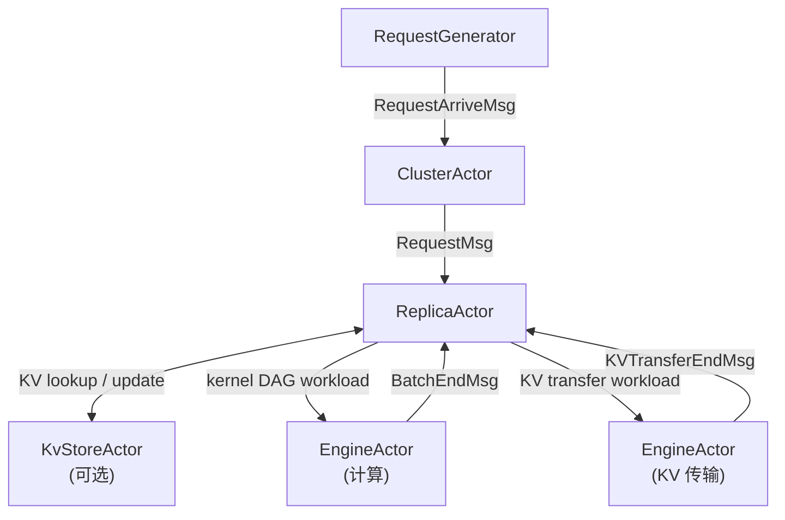
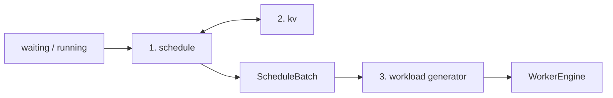

# hybridsim 推理仿真架构

`hybridsim_infer` 把一个 LLM serving 集群建模成一组 Actor：请求由生成器注入，经集群分发到实例，实例内做调度与 KV 管理，再把调度结果经 Analyzer 翻译成 kernel DAG，交给离散事件 Engine 执行。


---

## 输入与输出

```python
from hybridsim_infer import InferenceConfig, build_inference_simulation

cfg = InferenceConfig()
infra = build_inference_simulation(cfg)
infra.schedule_from_generator(gen)  # 或 schedule_arrivals(requests)
infra.run()

print(infra.metrics())
for req in infra.finished_requests:
    print(req.request_id, req.finished_at)
infra.check_errors()
```

### 输入

一次推理仿真的**对外边界**可以概括为两类输入、两类输出。静态配置字段见 **[inference_config.md](inference_config.md)**；请求注入见 **[request_generation.md](request_generation.md)**；


| 种类   | 何时提供                            | 类型 / 入口                                                                                     | 作用                                     |
| ---- | ------------------------------- | ------------------------------------------------------------------------------------------- | -------------------------------------- |
| 静态配置 | `build_inference_simulation` 之前 | `[InferenceConfig](inference_config.md)`                                                    | 集群拓扑、调度/KV 策略、workload 估时方式、可选落盘开关     |
| 请求负载 | build 之后                        | `[InferenceRequest](request_generation.md)` 列表或 `[RequestGenerator](request_generation.md)` | 每条请求的到达时刻、prefill/decode 长度、前缀与 PD 标志等 |


### 输出

仿真输出详情见 **[outputs.md](outputs.md)**


| 种类       | 入口                                                      | 内容                                                                 |
| -------- | ------------------------------------------------------- | ------------------------------------------------------------------ |
| 内存结果     | `infra.metrics()`、`infra.finished_requests`、`infra.now` | TTFT/TPS/命中率等聚合；已完成请求实体；DES 终态时间                                   |
| 文件产物（可选） | `output.*` + `run()` / `write_outputs()`                | `metrics.json`、`requests.jsonl`、`config.json`、Request Chrome Trace |


## 架构总览




### 请求生成

- **职责**：决定「什么时候来多少请求、每条多长、前缀怎么共享」。
- **输入 / 输出**：外部 trace 或分布 → `list[InferenceRequest]`。
- **不做**：不决定执行时长，也不进 `InferenceConfig`。

详见 [request_generation.md](request_generation.md)。

### 集群分发

- **职责**：请求在 replica 之间怎么放（当前只有 least-load）。
- **拓扑**：`monolith` 或 `pd`（Prefill / Decode 池）；replica **同构**，角色由请求上的 `kv_transfer_params` 区分。

详见上文 PD handoff 约定；调度细节见 [scheduler.md](scheduler.md)。

### 实例调度

replica 每step主要做三件事：




1. **schedule**：token budget、并发、KV 容量 → `ScheduleBatch`。（见[scheduler.md](scheduler.md)）
2. **kv**：allocate、prefix、远端 pull / lookup。（见[kv.md](kv.md)）
3. **workload generator**：`ScheduleBatch` → kernel DAG。（见 [workload_generator.md](workload_generator.md)）


### Engine执行

- **职责**：按 kernel DAG 依赖执行，推进仿真时钟。
- **当前**：几乎全部是 `TimeoutKernel`（`co_await sim.timeout(duration)`），时长已在 Analyzer / predictor 阶段算好。
- **目标**：comm / 计算类 kernel 分别驱动 **Network**、**Computing Platform** 仿真，Engine 只编排依赖与完成事件。

详见 [engine.md](engine.md)。

### 后续扩展：Computing Platform 与 Network


| 接口                     | 意图                       | 与 Engine 的关系              |
| ---------------------- | ------------------------ | ------------------------- |
| **Computing Platform** | GPU 计算仿真（算通、内存层次、SM 占用等） | 计算 kernel 在此消耗时间 / 争用资源   |
| **Network**            | 网络仿真（拓扑、链路带宽、拥塞、QoS 等）   | 通信 kernel（Put/Wait 等）在此传流 |


