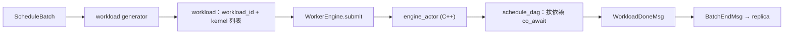

# hybridsim Engine 执行层

Engine 是仿真里唯一「消耗时间」的地方：调度和 KV 决定**算什么**，workload generator 决定**要多久**，Engine 负责按依赖关系把这些时长在 DES 时钟上走完。

本层在架构中的位置见 [architecture.md](architecture.md)。

相关代码：

| 角色 | 路径 |
|------|------|
| Replica 侧胶水 | [`actors/worker_engine.py`](../src/python/hybridsim_infer/actors/worker_engine.py)（`WorkerEngine`） |
| DES Engine Actor | [`engine/engine_actor.hpp`](../src/hybridsim/engine/engine_actor.hpp) |
| DAG 执行 | [`engine/dag_scheduler.hpp`](../src/hybridsim/engine/dag_scheduler.hpp) |
| kernel 实现 | [`engine/timeout_kernel.hpp`](../src/hybridsim/engine/timeout_kernel.hpp)、[`engine/kernel_factory.hpp`](../src/hybridsim/engine/kernel_factory.hpp) |

---

## 1. 一次提交的路径



workload 是一个普通 dict，kernel 之间用下标表示依赖：

```python
{
    "workload_id": 7,
    "kernels": [
        {"name": "L0.gemm_qkv", "duration": 3.2e-4, "dependencies": []},
        {"name": "L0.fused_attn", "duration": 1.1e-4, "dependencies": [0]},
    ],
}
```

`schedule_dag` 给每个节点起一个协程，先 `co_await` 所有前驱的完成事件，再跑自己的 kernel。没有依赖关系的节点天然并行（在 DES 意义上同时推进），整个 workload 的耗时等于关键路径长度。提交前会校验：依赖下标合法、无自环、无环。

---

## 2. WorkerEngine：并发槽位

`WorkerEngine` 不是 Actor，是 replica 持有的一层薄胶水，管一件事：**同时能有几个 batch 在飞**。

- 容量是 `schedule.engine.max_inflight_batches`，默认 1。
- 槽位从 `submit` 一直占到 replica 处理完 `BatchEndMsg` 后显式 `acknowledge`，覆盖「执行中」和「回调处理中」两段。这样调度不会在请求状态推进之前就把同一条请求编进下一个 batch。
- `inflight_request_ids()` 让 replica 在调度前把正在飞的请求摘出队列。

Worker 满时 replica 不再自发 `StepMsg`，直到 `BatchEndMsg` 把槽位放回来。

KV 传输走**另一个** EngineActor（启用 Store 时每个 replica 多分配一个），所以 KV pull/push 与计算天然并行，互不占槽。

---

## 3. kernel 只有一种

C++ 侧 `KernelFactory` 目前只注册了 `type=0` → `TimeoutKernel`：

```cpp
simcpp20::process<> run(simcpp20::simulation<> &sim) override {
  co_await sim.timeout(spec_.duration);
}
```

也就是说，**Engine 不建模任何硬件行为**，它只把 workload generator 算好的时长等出来。要加新的 kernel 语义（例如占用某种资源、与其它 kernel 争抢带宽），`register_creator` 留了扩展位。

---

## 4. 时长从哪来

| 来源 | 产出 | 代码 |
|------|------|------|
| `infer_workload.mode=batch_level` | 整个 batch 一个 kernel，时长由 predictor 给（`fixed` / `token_proportional` / `frontier`） | `BatchLevelWorkloadGenerator` |
| `infer_workload.mode=op_level` | 一层层算子 DAG，多个 kernel；GEMM / 融合 attn 走 Roofline，collective 走 α-β | `OpLevelWorkloadGenerator` |
| KV 传输 | 一个（或按页切分的若干串行）kernel，α-β | `KvWorkloadGenerator` |

op-level 的构图与估时见 [op_level_workload_generator.md](op_level_workload_generator.md)，KV 侧见 [kv.md](kv.md)。

---

## 5. 不做什么

框架图把网络仿真（拥塞、QoS、CC）和算通 overlap 画在 Engine 之下。这些**当前都没有接线**，设计文档里是 NO_NETWORK 模式：

- 没有链路 / 交换机模型，通信时长是 α-β 常数公式，不随并发退化
- 没有独立的 device 模型，计算时长是 Roofline 常数公式（带固定利用率系数）
- 计算与通信的 overlap 只能通过 op DAG 的依赖关系体现，没有流 / 队列级建模

所以现阶段的可信区间是：排队、并发、KV 容量与命中对端到端时延的影响；不是硬件级性能预测。op-level 的绝对时长需要离线校准，见 `tests/analytic_workload_calibration/`。
