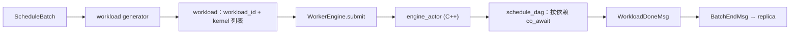

# hybridsim Engine 执行层

Engine 是仿真里唯一「消耗时间」的地方：调度和 KV 决定**算什么**，workload generator 决定**要多久**，Engine 负责按依赖关系把这些时长在 DES 时钟上走完。

本层在架构中的位置见 [architecture.md](architecture.md)。

相关代码：

| 角色 | 路径 |
|------|------|
| Replica 侧胶水 | [`actors/worker_engine.py`](../src/python/hybridsim_infer/actors/worker_engine.py)（`WorkerEngine`） |
| DES Engine Actor | [`engine/engine_actor.hpp`](../src/hybridsim/engine/engine_actor.hpp) |
| DAG 执行 | [`engine/dag_scheduler.hpp`](../src/hybridsim/engine/dag_scheduler.hpp) |
| kernel 实现 | [`engine/timeout_kernel.hpp`](../src/hybridsim/engine/timeout_kernel.hpp)、[`engine/comm_kernel.hpp`](../src/hybridsim/engine/comm_kernel.hpp)、[`engine/kernel_factory.hpp`](../src/hybridsim/engine/kernel_factory.hpp) |

---

## 1. 一次提交的路径



workload 是一个普通 dict，kernel 之间用下标表示依赖：

```python
{
    "workload_id": 7,
    "kernels": [
        {"name": "L0.gemm_qkv", "duration": 3.2e-4, "dependencies": []},
        {"name": "L0.fused_attn", "duration": 1.1e-4, "dependencies": [0]},
    ],
}
```

`schedule_dag` 给每个节点起一个协程，先 `co_await` 所有前驱的完成事件，再跑自己的 kernel。没有依赖关系的节点天然并行（在 DES 意义上同时推进），整个 workload 的耗时等于关键路径长度。提交前会校验：依赖下标合法、无自环、无环。

---

## 2. WorkerEngine：并发槽位

`WorkerEngine` 不是 Actor，是 replica 持有的一层薄胶水，管一件事：**同时能有几个 batch 在飞**。

- 容量是 `schedule.engine.max_inflight_batches`，默认 1。
- 槽位从 `submit` 一直占到 replica 处理完 `BatchEndMsg` 后显式 `acknowledge`，覆盖「执行中」和「回调处理中」两段。这样调度不会在请求状态推进之前就把同一条请求编进下一个 batch。
- `inflight_request_ids()` 让 replica 在调度前把正在飞的请求摘出队列。

Worker 满时 replica 不再自发 `StepMsg`，直到 `BatchEndMsg` 把槽位放回来。

开启 `network_sim` 时 Worker 持有 **N 个** EngineActor（每 rank 一个）。`per_rank` workload 并行下发，全部完成后才 BatchEnd；inflight 仍按 batch 计。

KV 传输走**另一个** EngineActor（启用 Store 时每个 replica 多分配一个），所以 KV pull/push 与计算天然并行，互不占槽。

---

## 3. kernel 类型

C++ 侧 `KernelFactory` 默认注册 `type=0` → `TimeoutKernel`：

```cpp
simcpp20::process<> run(simcpp20::simulation<> &sim) override {
  co_await sim.timeout(spec_.duration);
}
```

开启 `network_sim` 并 `install_network` 后还有：

| type | kernel | 行为 |
|------|--------|------|
| 1 | Put | 向本 Adapter inject 流后立即返回 |
| 2 | Signal | 同 Put，默认 64B |
| 3 | Wait | 等到匹配 `conn_id` 的流在本 Adapter 收完 |
| 4 | Get | fetch + wait 回包 |

通信 kernel 的 `duration` 为 0，时长由网络决定。详见 [network.md](network.md)。

---

## 4. 时长从哪来

| 来源 | 产出 | 代码 |
|------|------|------|
| `infer_workload.mode=batch_level` | 整个 batch 一个 kernel，时长由 predictor 给（`fixed` / `token_proportional` / `frontier`） | `BatchLevelWorkloadGenerator` |
| `infer_workload.mode=op_level` | 一层层算子 DAG；计算用 AnalyticAnalyzer（Roofline）；通信默认 α-β，或 `comm_analyzer=ring` 拆成 per-rank Put/Wait | `OpLevelWorkloadGenerator` |
| KV 传输 | 一个（或按页切分的若干串行）kernel，α-β | `KvWorkloadGenerator` |

op-level 的构图与估时见 [op_level_workload_generator.md](op_level_workload_generator.md)，KV 侧见 [kv.md](kv.md)。

---

## 5. 不做什么

默认（NO_NETWORK）下没有链路模型，通信时长是 α-β。开启 `network_sim` 后是**流级**共享（不是包级 / 窗口 CC），见 [network.md](network.md)。

- 没有独立的 device 模型，计算时长仍是 Roofline
- 计算与通信 overlap：DAG 依赖 + Put 立即返回
- KV 传输仍是 α-β TimeoutKernel
