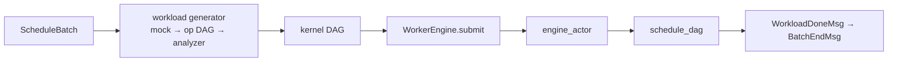

# hybridsim Engine 执行层

Engine 是仿真里**消耗 DES 时间**的执行器：调度与 KV 决定**本步算什么**，workload generator（经 Analyzer）决定**以何种 kernel DAG 表达**，Engine 按依赖把这些 kernel 跑完。

本层在架构中的位置见 [architecture.md](architecture.md)；workload 链路见 [workload_generator.md](workload_generator.md)。


| 角色                    | 路径                                                                                 |
| --------------------- | ---------------------------------------------------------------------------------- |
| python Engine wrapper | `[actors/worker_engine.py](../src/python/hybridsim_infer/actors/worker_engine.py)` |
| C++ Engine            | `[engine/engine_actor.hpp](../src/hybridsim/engine/engine_actor.hpp)`              |
| DAG                   | `[engine/dag_scheduler.hpp](../src/hybridsim/engine/dag_scheduler.hpp)`            |
| kernel                | `[engine/timeout_kernel.hpp](../src/hybridsim/engine/timeout_kernel.hpp)` 等        |


---


## 执行流程




workload 示例：

```python
{
    "workload_id": 7,
    "kernels": [
        {"name": "L0.gemm_qkv", "duration": 3.2e-4, "dependencies": []},
        {"name": "L0.fused_attn", "duration": 1.1e-4, "dependencies": [0]},
    ],
}
```

`schedule_dag` 对每个 kernel 起协程：先 `co_await` 前驱，再执行本 kernel。关键路径长度即该 workload 的仿真耗时。

---


## WorkerEngine：底层C++ engine的wrapper

- 容量：`schedule.engine.max_inflight_batches`（默认 1）。
- 从 `submit` 占到 `BatchEndMsg` 处理完并 `acknowledge`。
- KV 传输用**另一个** EngineActor，与计算槽位独立。


## kernel 类型


| type | 实现              | 行为                                        |
| ---- | --------------- | ----------------------------------------- |
| 0    | `TimeoutKernel` | `co_await sim.timeout(duration)`；**默认路径** |
| 1+   | comm 等（若启用）     | 与 Network 仿真对接；见未来 Network 文档             |


**当前主路径**：Analyzer 已在 kernel 上写好 `duration`，Engine 只等待，**不**建模 GPU 微架构或链路。

```cpp
// TimeoutKernel
co_await sim.timeout(spec_.duration);
```

目标形态：计算 kernel 调用 **Computing Platform**，通信 kernel 调用 **Network**，Engine 仍只编排 DAG 与完成事件。

---


