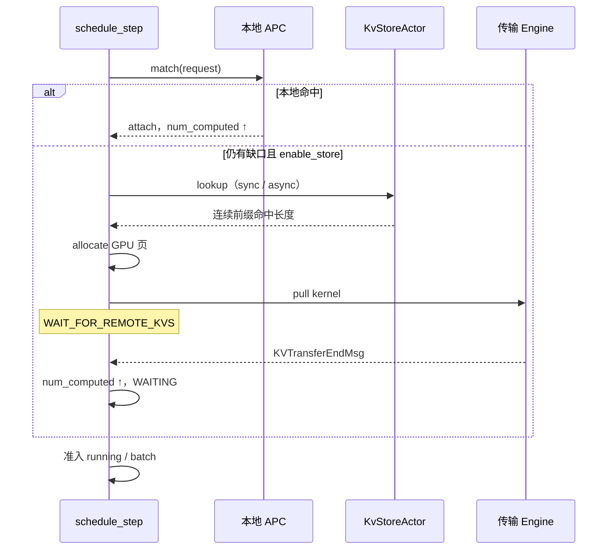
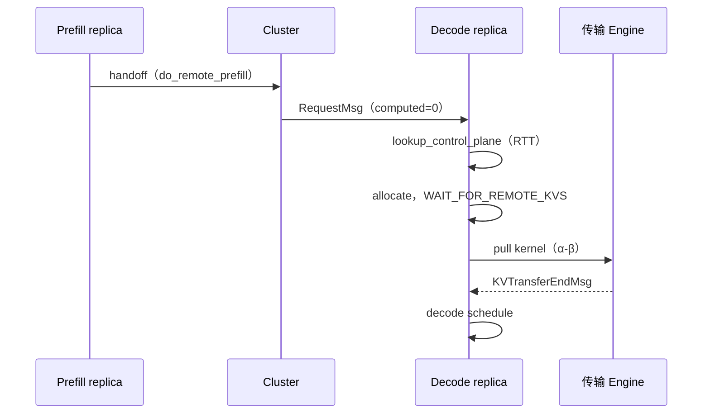

# hybridsim KV 子系统

[scheduler.md](scheduler.md) 把 KV 只当调度门控（`allocate` / `can_fit` 成或不成）。本文补上门后面的东西：块怎么记账、前缀怎么命中、远端 Store 怎么交互、PD Decode 怎么拉 KV。

相关代码：


| 角色           | 路径                                                                                                                                                                  |
| ------------ | ------------------------------------------------------------------------------------------------------------------------------------------------------------------- |
| 本地 GPU KV 管理 | `[kv_system/kv_managers.py](../src/python/hybridsim_infer/kv_system/kv_managers.py)`（`VllmKvCacheManager`）                                                          |
| block key 推导 | `[kv_system/block_keys.py](../src/python/hybridsim_infer/kv_system/block_keys.py)`                                                                                  |
| Store 客户端    | `[kv_system/client.py](../src/python/hybridsim_infer/kv_system/client.py)`（`KvClient`）                                                                              |
| Store master | `[actors/kv_store.py](../src/python/hybridsim_infer/actors/kv_store.py)` + `[kv_system/store_backend.py](../src/python/hybridsim_infer/kv_system/store_backend.py)` |
| 传输引擎         | `[workload_generators/kv_workload_generator/](../src/python/hybridsim_infer/workload_generators/kv_workload_generator/)`                                            |


配置：`kv`（页大小、容量、APC、Store 开关、lookup 协议）与 `kv_workload`（数据面带宽 / 延迟）。字段见 [inference_config.md](inference_config.md)。

---


## 调度流程


分为PD和Store两个场景


| 场景                       | 何时发生                                       | 目的                                     |
| ------------------------ | ------------------------------------------ | -------------------------------------- |
| **Prefix cache / Store** | Monolith 或 PD 的 Prefill 侧（以及 Monolith 全链路） | 用已有前缀抬高 `num_computed_tokens`，少算 token |
| **PD 传输**                | PD 分离下，Prefill handoff 之后 Decode 侧         | 从源 Prefill 拉 prompt KV，再开始 decode      |


### 1.1 Prefix cache / Store（两层命中）

调度准入时（`process_wait_queue`），若 `num_computed_tokens < num_prefill_tokens`，按顺序尝试：

1. **本地 APC**（`kv.enable_prefix_caching`）：`match` → `attach_cached_prefix`，页直接挂到请求，**不等传输**。
2. **远端 Store**（`kv.enable_store` 且非 `do_remote_prefill`）：`KvClient.lookup` 查最长连续 block key 命中 → `allocate` → `after_alloc_load` pull → `WAIT_FOR_REMOTE_KVS` → `KVTransferEndMsg` 后恢复。

两层都只做一件事：抬高 `num_computed_tokens`。本地未覆盖的部分才继续查 Store；Store 命中后仍需 pull 数据面。




算完一段后，`cache_request_prefix` / `save_computed_prefixes` 把新前缀发布到本地 APC 和（若启用）Store，供后续请求命中。

### 1.2 PD 传输

Prefill 算完 prompt 后发 `RequestHandoffMsg`；Cluster 把请求分到 Decode 池，并盖章 `do_remote_prefill=True`、`remote_replica_id=源 Prefill`，同时 **重置** `num_computed_tokens=0`。

Decode 侧不走 Prefix cache / Store 的 hash 路径，而是：

1. `lookup_control_plane`：按 `kv.lookup.rtt_s` 仿真控制面 RTT，直接认定**全 prompt 块对齐命中**（不查 Store）。
2. `allocate` + `after_alloc_load` pull，请求置 `WAIT_FOR_REMOTE_KVS`。
3. `KVTransferEndMsg`（pull）解锁后进入 decode schedule。




Decode 起点 ≈ prefill 结束 + 控制面 RTT + KV 传输时长。当前实现中 `KvClient` 与传输 Engine 随 `kv.enable_store=True` 挂载（控制面本身不依赖 Store master，但无传输 Engine 时 PD pull 不可用）。


## 本地 GPU KV 具体实现（Prefix cache 第一层）

`VllmKvCacheManager` 用页（block）记账，语义对齐 vLLM V1 `BlockPool`：

- 容量 `kv.num_gpu_blocks`，页大小 `kv.block_size`（token 数）。可用页是 `num_gpu_blocks - 1`，留一页 null block，与 vLLM 一致；`num_gpu_blocks <= 0` 视为无限。
- `allocate(request, num_new)` 只为「已 computed + 本步新增」扩容，不够返回 `None` → 调度侧转入抢占或停止准入。
- `free` / `preempt`：抢占把 `num_computed_tokens` 清零、页退回空闲链；`num_output_tokens` 保留（vLLM 语义）。
- 空闲页排成一条队列：没绑哈希的页优先被拿走，绑了哈希的页留在队尾当淘汰候选，在被真正复用之前仍然可以命中。

开启 APC 后：

- `match(request)` 返回最长前缀命中长度（按整页对齐）。
- `attach_cached_prefix` 把命中的页挂到该请求上并加引用。
- `cache_request_prefix` / `cache_blocks` 在请求算完一段之后把前缀发布出去，供后续同 prompt 请求命中。PD 的 Prefill 在 handoff 之前也会发布一次。

**块 key 怎么来**（`resolve_block_keys`）：有权威 `hash_ids`（公开 KV trace）就直接用；否则按 vLLM 的链式 sha256 从 `prompt_token_ids` 算。两者不能混用，细节见 [request_generation.md](request_generation.md)。


## 远端 Store 具体实现（Prefix cache 第二层）

启用 `kv.enable_store` 时，`build_inference_simulation` 会 spawn 一个共享 `KvStoreActor`，并给每个 replica 多分配一个 EngineActor 专门跑传输 kernel。

分工：

- `KvStoreActor` + `MooncakeKvStore`：只维护「哪些 block key 在池子里」+ 容量 + LRU 淘汰。处理 `KVLookupMsg` / `KVUpdateMsg`。
- `KvClient`（replica 持有，不是 Actor）：算 block key、发 RPC、按 α-β 估传输时长、往自己的传输 Engine 提交 pull/push kernel。

**Store 页可以粗于 GPU 页**：`kv.store.block_size` 必须是 `kv.block_size` 的整数倍，`coarsen_keys_for_store` 把 N 个 GPU 页的 key 合成一个 Store 对象 key，不满一个窗口的尾部丢弃。

### Lookup


| 模式                          | 行为                                                                                   |
| --------------------------- | ------------------------------------------------------------------------------------ |
| 同步（默认）                      | 调度过程中 `await client.lookup(...)`，master 返回最长连续前缀命中块数                                 |
| 异步（`kv.lookup.async_=True`） | 发出 `KVLookupMsg` 后立刻返回 `pending`（≈ vLLM 的 `None`），`KVLookupReplyMsg` 回来只写缓存，下一拍调度才消费 |


命中之后不是马上能算：先 `allocate` 本地页，再 `after_alloc_load` 提交 pull kernel，请求置 `WAIT_FOR_REMOTE_KVS`，等 `KVTransferEndMsg`（只有 `pull` 方向清状态）才重新可调度。

PD Decode（`do_remote_prefill`）**跳过**本节 lookup，走 §1.2 控制面路径。Prefill 侧（`do_remote_decode`）在 `remote_lookup` 中直接返回 miss，不做 Store 查询。

### Save

`BatchEndMsg` 之后 `save_computed_prefixes` 把**新算完的整块**写回 Store：

- 只保存 prefill 范围内的 token，decode 尾巴不存（与 vLLM 的 Mooncake connector 门控一致）
- 按 Store 页对齐，已存过的窗口不重复存
- master 允许写入后再 `submit_push` 提交 push kernel；push 的 `KVTransferEndMsg` 不影响调度


## 传输时长估计模型


pull / push 都只是一个 `TimeoutKernel`，时长由 `KvWorkloadGenerator` 用 α-β 估（**解析占位**，不是 Engine 之下的 Network 细粒度仿真）：

```text
duration = max(transfer_s_floor, latency_s + bytes / bandwidth)
bytes    = num_tokens * bytes_per_token
```

`bytes_per_token` 优先从 `model.preset` 的 KV 公式算（GQA / MLA / DSA 各有公式），没有 preset 时用 `kv_workload.bytes_per_token`。这条链路和 op-level 的 collective `NetworkConfig` 是两套参数，别混。

