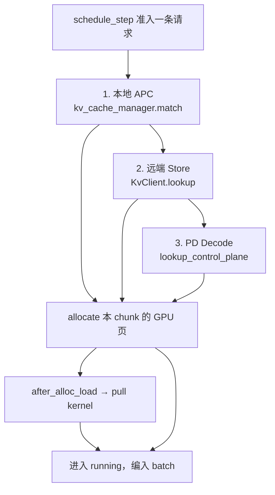

# hybridsim KV 子系统

[scheduler.md](scheduler.md) 把 KV 只当调度门控（`allocate` / `can_fit` 成或不成）。本文补上门后面的东西：块怎么记账、前缀怎么命中、远端 Store 怎么交互、PD Decode 怎么拉 KV。

本层在架构中的位置见 [architecture.md](architecture.md)。

相关代码：

| 角色 | 路径 |
|------|------|
| 本地 GPU KV | [`kv_system/kv_managers.py`](../src/python/hybridsim_infer/kv_system/kv_managers.py)（`VllmKvCacheManager`） |
| 块 key 推导 | [`kv_system/block_keys.py`](../src/python/hybridsim_infer/kv_system/block_keys.py) |
| Store 客户端 | [`kv_system/client.py`](../src/python/hybridsim_infer/kv_system/client.py)（`KvClient`） |
| Store master | [`actors/kv_store.py`](../src/python/hybridsim_infer/actors/kv_store.py) + [`kv_system/store_backend.py`](../src/python/hybridsim_infer/kv_system/store_backend.py) |
| 传输时长 | [`workload_generators/kv_workload_generator/`](../src/python/hybridsim_infer/workload_generators/kv_workload_generator/) |

配置：`kv`（页大小、容量、APC、Store 开关、lookup 协议）与 `kv_workload`（数据面带宽 / 延迟）。字段见 [inference_config.md](inference_config.md)。

---

## 1. 三条路径



三条路径都只做一件事：**把 `num_computed_tokens` 抬高，从而减少本步真正要算的 token**。区别是数据从哪来、要不要等传输。

| 路径 | 触发条件 | 是否等传输 | key 来源 |
|------|----------|------------|----------|
| 本地 APC | `kv.enable_prefix_caching=True` | 否，页直接 attach | 本 replica 的块表 |
| 远端 Store | `kv.enable_store=True` 且非 PD Decode | 是，pull kernel | Store 上的 block key |
| PD 控制面 | 请求带 `do_remote_prefill` | 是，先 RTT 再 pull | 不做 hash 匹配，直接认全 prompt 命中 |

---

## 2. 本地 GPU KV

`VllmKvCacheManager` 用页（block）记账，语义对齐 vLLM V1 `BlockPool`：

- 容量 `kv.num_gpu_blocks`，页大小 `kv.block_size`（token 数）。可用页是 `num_gpu_blocks - 1`，留一页 null block，与 vLLM 一致；`num_gpu_blocks <= 0` 视为无限。
- `allocate(request, num_new)` 只为「已 computed + 本步新增」扩容，不够返回 `None` → 调度侧转入抢占或停止准入。
- `free` / `preempt`：抢占把 `num_computed_tokens` 清零、页退回空闲链；`num_output_tokens` 保留（vLLM 语义）。
- 空闲页排成一条队列：没绑哈希的页优先被拿走，绑了哈希的页留在队尾当淘汰候选，在被真正复用之前仍然可以命中。

开启 APC 后：

- `match(request)` 返回最长前缀命中长度（按整页对齐）。
- `attach_cached_prefix` 把命中的页挂到该请求上并加引用。
- `cache_request_prefix` / `cache_blocks` 在请求算完一段之后把前缀发布出去，供后续同 prompt 请求命中。PD 的 Prefill 在 handoff 之前也会发布一次。

**块 key 怎么来**（`resolve_block_keys`）：有权威 `hash_ids`（公开 KV trace）就直接用；否则按 vLLM 的链式 sha256 从 `prompt_token_ids` 算。两者不能混用，细节见 [request_generation.md](request_generation.md)。

---

## 3. 远端 Store

启用 `kv.enable_store` 时，`build_inference_simulation` 会 spawn 一个共享 `KvStoreActor`，并给每个 replica 多分配一个 EngineActor 专门跑传输 kernel。**Store 正交于拓扑**：monolith 和 PD 都能挂。

分工：

- `KvStoreActor` + `MooncakeKvStore`：只维护「哪些 block key 在池子里」+ 容量 + LRU 淘汰。处理 `KVLookupMsg` / `KVUpdateMsg`。
- `KvClient`（replica 持有，不是 Actor）：算 block key、发 RPC、按 α-β 估传输时长、往自己的传输 Engine 提交 pull/push kernel。

**Store 页可以粗于 GPU 页**：`kv.store.block_size` 必须是 `kv.block_size` 的整数倍，`coarsen_keys_for_store` 把 N 个 GPU 页的 key 合成一个 Store 对象 key，不满一个窗口的尾部丢弃。

### Lookup

| 模式 | 行为 |
|------|------|
| 同步（默认） | 调度过程中 `await client.lookup(...)`，master 返回最长连续前缀命中块数 |
| 异步（`kv.lookup.async_=True`） | 发出 `KVLookupMsg` 后立刻返回 `pending`（≈ vLLM 的 `None`），`KVLookupReplyMsg` 回来只写缓存，下一拍调度才消费 |

命中之后不是马上能算：先 `allocate` 本地页，再 `after_alloc_load` 提交 pull kernel，请求置 `WAIT_FOR_REMOTE_KVS`，等 `KVTransferEndMsg`（只有 `pull` 方向清状态）才重新可调度。

### Save

`BatchEndMsg` 之后 `save_computed_prefixes` 把**新算完的整块**写回 Store：

- 只保存 prefill 范围内的 token，decode 尾巴不存（与 vLLM 的 Mooncake connector 门控一致）
- 按 Store 页对齐，已存过的窗口不重复存
- master 允许写入后再 `submit_push` 提交 push kernel；push 的 `KVTransferEndMsg` 不影响调度

---

## 4. PD Decode 的控制面 lookup

请求被 handoff 到 Decode 侧时带着 `do_remote_prefill` 和源 Prefill 的 `remote_replica_id`。这条路径**跳过 Store hash 匹配**：Decode 明确知道 KV 在哪台 Prefill 上，只需要仿真一次控制面往返。

1. `lookup_control_plane` 按 `kv.lookup.rtt_s` 延迟发一条 `KVLookupReplyMsg`，请求先记 `pending`。
2. Reply 回来后按「整个 prompt 命中」处理。
3. `allocate` + `after_alloc_load` 拉 KV，等 `KVTransferEndMsg` 解锁，再开始 decode。

因此 PD 下一条请求的 decode 起点 ≈ prefill 结束 + 控制面 RTT + KV 传输时长。

---

## 5. 传输时长怎么算

pull / push 都只是一个 `TimeoutKernel`，时长由 `KvWorkloadGenerator` 用 α-β 估：

```text
duration = max(transfer_s_floor, latency_s + bytes / bandwidth)
bytes    = num_tokens * bytes_per_token
```

`bytes_per_token` 优先从 `model.preset` 的 KV 公式算（GQA / MLA / DSA 各有公式），没有 preset 时用 `kv_workload.bytes_per_token`。这条链路和 op-level 的 collective `NetworkConfig` 是两套参数，别混。

---

## 6. 不做什么

- 不是真 RDMA：没有 bootstrap 端口、TransferEngine、mooncake_master 进程
- 不做与 vLLM 逐比特一致的 block hash（公开 trace 的 remapped `hash_ids` 与 vLLM hasher 不可混比）
- 没有 Prefill 侧 push 算子的细粒度建模，push 只是一个时长
- 不建模链路拥塞：带宽是常数，不随并发退化

交互时序的对齐测试见 `tests/mooncake_alignment/`。
