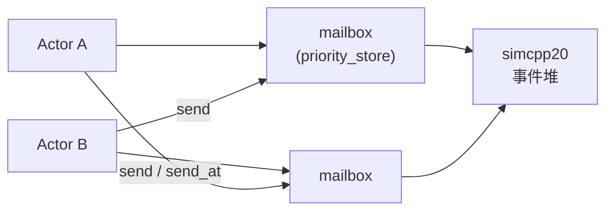

# DES + Actor 基座

hybridsim 的底层是一个**离散事件驱动（DES）+ Actor** 仿真运行时。推理仿真（`hybridsim_infer`）的 Cluster / Replica / Engine 等组件都建在这套基座之上。本文说明设计动机与核心抽象；API 用法见仓库根 [README.md](../README.md) 安装与示例一节。

---

## 1. 离散事件仿真（DES）

DES 的本质是一个按**仿真时间**排序的**事件堆**（优先队列）。每个事件对应一个回调；仿真器从堆顶不断取出「当前时刻最早」的事件并执行其回调，时间指针随之推进——这就是仿真推进的过程。

由于事件只在离散时刻发生，推进过程也是**离散**的：不需要像实时仿真那样固定时间步长积分。只要在合适的时间点投递事件，就可以把某一子系统建模得很细（例如逐 kernel 完成），而把不关心的部分压缩成单个 `timeout`（data-based 黑箱）。**粒度因此可以自由调节**。

```text
事件堆（按 time 排序）
  t=0.01  Replica: BatchEndMsg
  t=0.02  Cluster: RequestArriveMsg
  t=0.05  Engine:  WorkloadDoneMsg
        ↓ pop & 执行回调
      sim.now 前进
```

hybridsim 的 DES 内核基于 [simcpp20](https://github.com/fschuetz04/simcpp20)（C++20 协程实现），Python 通过 `hybridsim_py` 绑定暴露 `Simulation.run()` / `now()` 等接口（[`simulation.py`](../src/python/hybridsim/simulation.py)）。

---

## 2. 为什么是单线程

DES 天然倾向于**单线程**推进：每个逻辑线程都在不断产出和消费事件。若用多个 OS 线程并行跑 DES，各线程产出的事件很难全局保序，**因果关系**可能错乱（后发生的事件先被处理）。

真实系统往往是多线程、多组件并发的；仿真的首要问题则是：**如何用单线程逻辑模拟多线程行为**。做法是频繁在多个「执行上下文」之间切换——处理完一个挂起点立刻调度下一个，直到堆中再无就绪事件。

这种切换若用裸回调表达，容易陷入 **callback hell**。因此仿真库普遍引入**协程**：异步挂起与恢复由运行时负责，业务代码可以写成「看起来同步」的顺序逻辑。

---

## 3. 借鉴 SimPy：process 与 store

[SimPy](https://simpy.readthedocs.io/) 在协程之上抽象了多线程系统中常见的模式；hybridsim 通过 simcpp20 提供类似语义，使仿真代码结构更接近真实系统。

### process（协程 / 轻量「线程」）

一个 `process` 模拟一条独立控制流。运行中若需等待（耗时 I/O、定时器、消息），协程 **yield** 交出 CPU，DES 调度其他 process；条件满足后再恢复。

典型模式：模拟耗时步骤时 `co_await sim.timeout(duration)`，在 `duration` 仿真时间后自动切回本 context 继续执行。

```cpp
// C++：延迟投递消息
co_await sim.timeout(when - sim.now());
self.send(std::move(msg));
```

### store（同步 get / put）

`store` 是有界或无限的缓冲通道：

- **get**：若 store 中尚无对象，等待方挂起，直到另一处 **put** 唤醒。
- **put**：对象入队；若有等待的 get，立即配对并唤醒。

hybridsim 中每个 Actor 的 **mailbox** 即是一个带优先级的 store（[`priority_store.hpp`](../src/hybridsim/priority_store.hpp)）：`send` → `put`，`run_loop` 里 `co_await mailbox_.get()` → 取消息并分发给 handler。

```cpp
// actor.hpp：主循环
while (running_) {
  auto msg = co_await mailbox_.get();
  co_await handler(sim, self, msg);  // 可为 async handler
}
```

同优先级内 FIFO；支持多级 priority（高优先级消息先被 `get` 到），用于调度类消息优先于普通流量。

---

## 4. Actor 系统

在 process + store 之上，hybridsim 构建了 **Actor** 模型，把「子系统」封装为自治实体，**只通过消息**交互，便于与真实 infra 的分层/服务边界对齐。



### 核心能力

| 能力 | 说明 |
|------|------|
| `send` / `send_at` | 向目标 Actor mailbox 投递消息；可带 `delay` 在未来仿真时刻到达 |
| `on<Msg>(handler)` | 注册消息处理；handler 可为同步函数或返回 `process<>` 的协程 |
| `request` / `reply` | 请求-响应：发送方 `co_await request(...)`，接收方 `reply(value)`，避免手写配对逻辑 |
| `start` / `stop` | 启动 / 中止 Actor 的 `run_loop` process |

实现见 [`actor.hpp`](../src/hybridsim/actor.hpp)。异步 handler 在 [`handler.hpp`](../src/hybridsim/handler.hpp) 中统一 `co_await` 调度。

### Python 与 C++ 双绑定

| 层 | 路径 | 用途 |
|----|------|------|
| C++ | `src/hybridsim/` | 高性能核心：`actor`、`engine_actor`、kernel DAG 调度 |
| Python 绑定 | `src/python/binding/` → `hybridsim_py` | 暴露 `Simulation`、`Actor`、`EngineActor`、`ReplyFuture`（可 `await`） |
| Python 封装 | `src/python/hybridsim/` | `ActorBase` + `@on` 装饰器、`Simulation.spawn_actor`、消息注册 |

Python 侧推荐继承 `ActorBase`，用 dataclass 定义消息类型；需要跨 Actor RPC 时在 `async def` handler 里 `await self.request(target, Msg, ...)`。

C++ 侧可直接继承 `hybridsim::actor` 或 `engine_actor`（[`engine_actor.hpp`](../src/hybridsim/engine/engine_actor.hpp)），在 kernel 完成时 `send(WorkloadDoneMsg)`。

推理仿真 [`hybridsim_infer`](../src/python/hybridsim_infer/) 主要在 **Python** 实现 Actor 逻辑（Cluster / Replica / KV Store），计算密集或已有 C++ 模型的部分挂在 **EngineActor** 上，通过消息提交 workload。这样不同子系统可用不同语言实现，只要共享同一 `Simulation` 事件堆与消息表。

---

## 5. 与推理仿真的关系

| 概念（本文） | 在 `hybridsim_infer` 中的例子 |
|--------------|-------------------------------|
| Actor + 消息 | `ClusterActor`、`ReplicaActor`、`KvStoreActor` |
| `send_at` / `timeout` | 请求 `arrived_at` 到达、`kv.lookup.rtt_s` 控制面延迟 |
| store 式等待 | mailbox 排队；`WAIT_FOR_REMOTE_KVS` 直到 `KVTransferEndMsg` |
| data-based 粒度 | `TimeoutKernel` 直接 `co_await timeout(duration)` |
| mock-based 粒度 | `VllmScheduler`、`KvClient` 白盒状态机 |

推理分层与数据流见 [architecture.md](architecture.md)。

---

## 6. 相关代码入口

| 文件 | 内容 |
|------|------|
| [`src/hybridsim/actor.hpp`](../src/hybridsim/actor.hpp) | Actor 主循环、send/request/reply |
| [`src/hybridsim/priority_store.hpp`](../src/hybridsim/priority_store.hpp) | 优先级 mailbox |
| [`src/python/hybridsim/actor_base.py`](../src/python/hybridsim/actor_base.py) | Python `ActorBase` / `@on` |
| [`src/python/hybridsim/simulation.py`](../src/python/hybridsim/simulation.py) | `Simulation` 生命周期 |
| [`examples/actor_python_demo.py`](../examples/actor_python_demo.py) | 最小 Python Actor 示例 |
