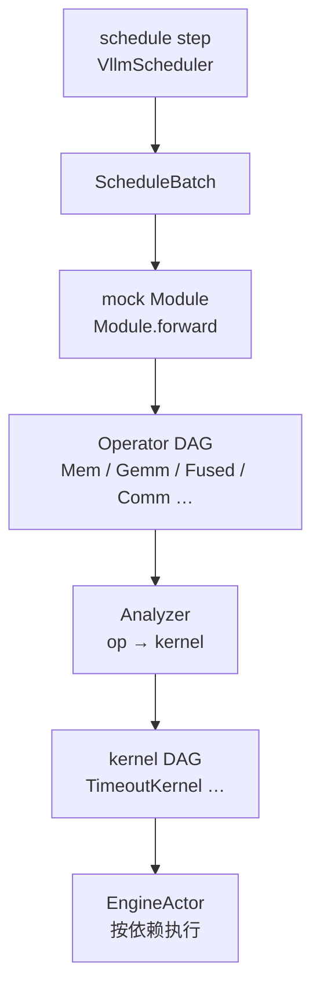

# Workload generator

> **本层位置**：replica 内 `schedule` → `kv` 之后的第三步。把 **ScheduleBatch** 变成 Engine 可执行的 **kernel DAG**。全景见 [architecture.md](architecture.md)；执行见 [engine.md](engine.md)。

Replica 内第三步把 **ScheduleBatch** 变成 Engine 能跑的 **kernel DAG**。当前实现是 **Analyzer** 在中间做 lowering；目标架构里计算与通信会分别接到 **Computing Platform** 与 **Network** 细粒度仿真，届时 Analyzer 只负责 op → primitive / kernel 的形态转换，时长由下层仿真决定。

## 生成到执行（op_level 主路径）

| 阶段 | 输入 | 输出 | 当前谁在做 |
|------|------|------|------------|
| schedule step | waiting / running 队列 | `ScheduleBatch` | `VllmScheduler` |
| mock module | batch 特征 + 模型形状 | Operator DAG | `OpLevelWorkloadGenerator.build_dag` |
| analyzer | Operator DAG | kernel DAG（含 `duration` 或 comm primitive） | `AnalyticAnalyzer` 等 |
| engine | kernel DAG | 推进 DES 时钟、`BatchEndMsg` | C++ `engine_actor` |

- **mock module** 只负责形状与依赖，不估时。
- **Analyzer** 是「op DAG → kernel DAG」的一种实现方式；当前用解析公式在 kernel 上填 `duration`（`TimeoutKernel`）。
- **Computing Platform** / **Network** 是 Engine 之下的细粒度仿真接口（待实现）。接入后，Analyzer 仍负责形态 lowering，时长改由仿真层决定。

`batch_level` 模式跳过 mock / op DAG，由 predictor 直接给出整 batch 的一个 `TimeoutKernel`。

**不要混淆**：配置里的 `DeviceConfig` / `NetworkConfig`（`infer_workload.op.device` / `.network`）是 **Analyzer 用的解析公式参数**（Roofline、α-β），不是 Computing Platform / Network 仿真器。

## 模式分层

| 模式 | 路径 |
|------|------|
| `infer_workload.mode=batch_level` | batch → 整 batch 时长（fixed / token-proportional / Frontier RF） |
| `infer_workload.mode=op_level` | batch → mock → op DAG → analyzer → kernel DAG |
| KV 传输 | 独立 `KvWorkloadGenerator`，与 infer op DAG 分开 |

`BatchFeatures` 只喂给 `Module.forward`，不写入叶子 Op。

## 叶子原语（mock）

| 类 | 记录 | Analyzer 侧代价（当前） |
|----|------|-------------------------|
| `MemOp` | 形状 + `dtype_bytes` | `bytes / bw`（Roofline 内存项） |
| `GemmOp` | `A[M,K]`、`B[K,N]` | Roofline |
| `FusedAttnOp` / `FusedMlaAttnOp` | Q/K/V 形状 + `prefill\|decode` | 融合 Roofline 公式 |
| `CommOp` | payload + collective + `num_ranks` | α-β；`ranks<=1` 可不建节点 |

并行在构图时通过 `Shape.split`、是否插入 `CommOp` 体现。`Op.name` 仅调试（如 `L3.gemm_qkv`）。

## Mock 构图

- `Module` / `Shape` / `Tensor` / `Graph`：与 torch 风格接近的静态展开。
- `build_operator_dag(model, parallel, batch)` 产出 `OperatorDAG`。

`first_k_dense_replace` 切换 dense FFN / MoE；DSA v1 用 MLA 融合核 + indexer `MemOp`。

## Analyzer

**职责**：把 Operator DAG lower 成 kernel DAG（名称、依赖、`duration` 或 comm primitive 类型）。

当前默认 `AnalyticAnalyzer`：

- `lower_op` 读 `op.features()` + `op.kind`，不按融合子类硬编码分支。
- Mem → `mem_scale * bytes / effective_hbm_bw`
- GEMM / FUSED → Roofline（`flops`、`bytes` vs `DeviceConfig` 峰值）
- Comm → `ab_comm_time_s`（`NetworkConfig` α-β）

新融合核：加 `FusedOp` 子类 + 特征字段即可。

计算与通信可挂不同 Analyzer 实现（例如通信将来 lower 成 Put/Wait，交给 Network 仿真定长）。配置项 `OpLevelConfig.compute_analyzer` / `comm_analyzer` 用于选择实现（见 [inference_config.md](inference_config.md)）。

### 配置名与目标接口

| 配置字段 | 代码类型 | 文档含义 |
|----------|----------|----------|
| `infer_workload.op.device` | `DeviceConfig` | Analyzer 的 **Roofline 占位参数**，不是 Computing Platform 仿真器 |
| `infer_workload.op.network` | `NetworkConfig` | Analyzer 的 **α-β 占位参数**，不是 Network 仿真器 |

`duration_scale` 为全局乘子，常用于离线校准后填入。

`predict_duration_s` 等路径只走解析 Analyzer，不把未来的 comm primitive 算进 critical path，除非显式配置。

## 与 Engine 的边界

Analyzer 产出 dict：`workload_id` + `kernels[]`（`name`、`duration`、`dependencies`，或带 `type`/`params` 的 comm kernel）。Engine **不**回头读 Operator DAG，也 **不**实现 Roofline / α-β；只执行已给定的 kernel DAG。
