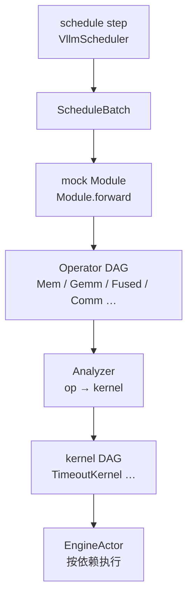

# Workload generator

> **本层位置**：replica 内 `schedule` → `kv` 之后的第三步。把 **ScheduleBatch** 变成 Engine 可执行的 **kernel DAG**。全景见 [architecture.md](architecture.md)；执行见 [engine.md](engine.md)。

Replica 内第三步把 **ScheduleBatch** 变成 Engine 能跑的 **kernel DAG**。然后通过**Analyzer** 做解析建模；目标架构里计算与通信会分别接到 **Computing Platform** 与 **Network** 细粒度仿真，届时 Analyzer 只负责 op → primitive / kernel 的形态转换，时长由下层仿真决定。

## 生成到执行（op_level 主路径）




| 阶段            | 输入                   | 输出                                        | 当前谁在做                                |
| ------------- | -------------------- | ----------------------------------------- | ------------------------------------ |
| schedule step | waiting / running 队列 | `ScheduleBatch`                           | `VllmScheduler`                      |
| mock module   | batch 特征 + 模型形状      | Operator DAG                              | `OpLevelWorkloadGenerator.build_dag` |
| analyzer      | Operator DAG         | kernel DAG（含 `duration` 或 comm primitive） | `AnalyticAnalyzer` 等                 |
| engine        | kernel DAG           | 推进 DES 时钟、`BatchEndMsg`                   | C++ `engine_actor`                   |


- **mock module** 只负责形状与依赖，不估时。
- **Analyzer** 是「op DAG → kernel DAG」的一种实现方式；当前用解析公式在 kernel 上填 `duration`（`TimeoutKernel`）。
- **Computing Platform** / **Network** 是 Engine 之下的细粒度仿真接口（待实现）。接入后，Analyzer 仍负责形态 lowering，时长改由仿真层决定。

`batch_level` 模式跳过 mock / op DAG，由 predictor 直接给出整 batch 的一个 `TimeoutKernel`。

**不要混淆**：配置里的 `DeviceConfig` / `NetworkConfig`（`infer_workload.op.device` / `.network`）是 **Analyzer 用的解析公式参数**（Roofline、α-β），不是 Computing Platform / Network 仿真器。

## 模式分层


| 模式                                | 路径                                                           |
| --------------------------------- | ------------------------------------------------------------ |
| `infer_workload.mode=batch_level` | batch → 整 batch 时长（fixed / token-proportional / Frontier RF） |
| `infer_workload.mode=op_level`    | batch → mock → op DAG → analyzer → kernel DAG                |
| KV 传输                             | 独立 `KvWorkloadGenerator`，与 infer op DAG 分开                   |


## Mock 模块设计

mock 子系统负责 **op_level** 路径上的构图：在 `Module.forward` 执行过程中，按 batch 形状与模型配置**静态展开**算子序列与依赖，产出 `OperatorDAG`。**只记录形状与依赖，不估时**——时长由后续 Analyzer 根据 `op.features()` 填写。

### 核心组件


| 组件                                           | 作用                                                |
| -------------------------------------------- | ------------------------------------------------- |
| `Module` / `Shape` / `Tensor`                | 类 torch 的嵌套模块与形状张量；`Tensor.producer` 指向产生它的 op 下标 |
| `Graph`                                      | 上下文管理器，在 `forward` 期间收集 `Op` 并自动推导 `deps`         |
| `CommContext`                                | 在构图时插入 `CommOp`（TP all-reduce、PP p2p 等）           |
| `build_operator_dag(model, parallel, batch)` | 入口：构造 `Transformer`、执行 `forward`、返回 `OperatorDAG` |


并行在构图时体现：`Shape.split` 切分权重维度；`tp_size > 1` 时在 attention / MLP 后插入 `CommOp`。`Op.name` 仅调试用（如 `L3.gemm_qkv`）。

`ModelConfig.first_k_dense_replace` 控制 dense FFN / MoE 切换；DSA v1 走 MLA 融合核 + indexer `MemOp`。


### 叶子Op


DAG的构建过程可以向torch一样通过Module嵌套，嵌套最底层叶子节点是以下四种原子Op


| 类                                | 记录                                 | Analyzer 侧代价（当前）           |
| -------------------------------- | ---------------------------------- | -------------------------- |
| `MemOp`                          | 形状 + `dtype_bytes`                 | `bytes / bw`（Roofline 内存项） |
| `GemmOp`                         | `A[M,K]`、`B[K,N]`                  | Roofline                   |
| `FusedAttnOp` / `FusedMlaAttnOp` | Q/K/V 形状 + `prefill|decode`        | 融合 Roofline 公式             |
| `CommOp`                         | payload + collective + `num_ranks` | α-β；`ranks<=1` 可不建节点       |


各原语提供 `apply(...)` 类方法：在活跃 `Graph` 内创建 op 并返回输出 `Tensor`，依赖由输入 tensor 的 `producer` 自动链接。


### 示例

典型用法：用 preset / `ModelConfig` + `BatchFeatures` 展开整网：

```python
from hybridsim_infer.workload_generators.configs import ModelConfig, ParallelConfig
from hybridsim_infer.workload_generators.infer_workload_generator.batch_features import (
    BatchFeatures,
    BatchPhase,
)
from hybridsim_infer.workload_generators.infer_workload_generator.op_level.mock.models.transformer import (
    build_operator_dag,
)

batch = BatchFeatures(
    phase=BatchPhase.PREFILL,
    num_tokens=128,
    num_prefill_tokens=128,
    num_decode_tokens=0,
    batch_size=1,
    prefill_chunk_lens=[128],
    prefill_cached_lens=[0],
)

dag = build_operator_dag(
    model=ModelConfig(num_layers=2, hidden_size=4096),
    parallel=ParallelConfig(tp_size=2),
    batch=batch,
)

print(dag.op_names())  # gemm_qkv, fused_attn, attn_tp_allreduce, ...
for op in dag.operators:
    print(op.kind.name, op.name, "deps=", op.deps)
```

自定义层时，在 `Graph` 上下文里用 `GemmOp.apply` 等挂接依赖（与内置 `Attention` 相同模式）：

```python
from hybridsim_infer.workload_generators.infer_workload_generator.op_level.mock.graph import Graph
from hybridsim_infer.workload_generators.infer_workload_generator.op_level.mock.module import Module
from hybridsim_infer.workload_generators.infer_workload_generator.op_level.mock.ops import GemmOp
from hybridsim_infer.workload_generators.infer_workload_generator.op_level.mock.shape import Shape
from hybridsim_infer.workload_generators.infer_workload_generator.op_level.mock.tensor import Tensor

class TinyLinear(Module):
    def forward(self, x: Tensor) -> Tensor:
        h = int(x.shape[1])
        w = Shape([h, h]).split(1, 2)  # TP：按列切分权重
        return GemmOp.apply(x, w, name="tiny.gemm")

tokens, hidden = 64, 512
x = Tensor(shape=(tokens, hidden), producer=None, dtype_bytes=2)
with Graph() as g:
    y = TinyLinear()(x)
dag = g.to_operator_dag()
```

代码路径：`workload_generators/infer_workload_generator/op_level/mock/`；构图测试见 `tests/test_mock_dag.py`。

自定义**融合算子**：继承 `FusedOp`，实现 `infer_out_shape()` 与 `features()`（返回 `flops` / `bytes` 供 Roofline）；`AnalyticAnalyzer` 的 `lower_op` 按 `kind=FUSED` 统一处理，**无需改 Analyzer 分支**。

```python
from dataclasses import dataclass
from typing import Any

from hybridsim_infer.workload_generators.infer_workload_generator.op_level.mock.fused import FusedOp
from hybridsim_infer.workload_generators.infer_workload_generator.op_level.mock.graph import Graph
from hybridsim_infer.workload_generators.infer_workload_generator.op_level.mock.module import Module
from hybridsim_infer.workload_generators.infer_workload_generator.op_level.mock.tensor import Tensor

@dataclass
class FusedRmsNormOp(FusedOp):
    """示例：融合 RMSNorm（形状 + 自定义 flops/bytes 公式）。"""

    m: int = 0
    hidden: int = 0

    def infer_out_shape(self) -> tuple[int, ...]:
        return (int(self.m), int(self.hidden))

    def features(self) -> dict[str, Any]:
        m, h = int(self.m), int(self.hidden)
        dtype = max(1, int(self.dtype_bytes))
        flops = 6.0 * m * h          # 读 x、归约、scale 的近似 FLOPs
        nbytes = dtype * m * h * 3   # 读 + 写 + 中间缓冲
        return {"flops": flops, "bytes": float(nbytes)}

    @classmethod
    def apply(cls, x: Tensor, *, name: str) -> Tensor:
        return cls(
            name=name,
            m=int(x.shape[0]),
            hidden=int(x.shape[1]),
            dtype_bytes=x.dtype_bytes,
        ).record(x)


class BlockWithRmsNorm(Module):
    def forward(self, x: Tensor) -> Tensor:
        return FusedRmsNormOp.apply(x, name="L0.rms_norm")


with Graph() as g:
    x = Tensor(shape=(128, 4096), producer=None, dtype_bytes=2)
    BlockWithRmsNorm()(x)
dag = g.to_operator_dag()
```

在 `Attention` / `DecoderLayer` 等内置模块里插入自定义 `FusedOp` 子类，模式相同：构图只记形状，`features()` 决定 Analyzer 侧的 Roofline 输入。

## Analyzer

**职责**：把 Operator DAG lower 成 kernel DAG（名称、依赖、`duration` 或 comm primitive 类型）。

当前默认 `AnalyticAnalyzer`：

- `lower_op` 读 `op.features()` + `op.kind`，不按融合子类硬编码分支。
- Mem → `mem_scale * bytes / effective_hbm_bw`
- GEMM / FUSED → Roofline（`flops`、`bytes` vs `DeviceConfig` 峰值）
- Comm → `ab_comm_time_s`（`NetworkConfig` α-β）

新融合核：加 `FusedOp` 子类 + 特征字段即可。

计算与通信可挂不同 Analyzer 实现（例如通信将来 lower 成 Put/Wait，交给 Network 仿真定长）。配置项 `OpLevelConfig.compute_analyzer` / `comm_analyzer` 用于选择实现（见 [inference_config.md](inference_config.md)）。

### 配置名与目标接口


| 配置字段                        | 代码类型            | 文档含义                                                   |
| --------------------------- | --------------- | ------------------------------------------------------ |
| `infer_workload.op.device`  | `DeviceConfig`  | Analyzer 的 **Roofline 占位参数**，不是 Computing Platform 仿真器 |
| `infer_workload.op.network` | `NetworkConfig` | Analyzer 的 **α-β 占位参数**，不是 Network 仿真器                 |


`duration_scale` 为全局乘子，常用于离线校准后填入。

`predict_duration_s` 等路径只走解析 Analyzer，不把未来的 comm primitive 算进 critical path，除非显式配置。

### Roofline 校准（规划）

当前默认用 `DeviceConfig` 的全局 `compute_util` / `hbm_util`（有效峰值 = 标称峰值 × util），以及可选的全局 `duration_scale` 做一次性缩放。这对粗粒度对齐够用，但无法反映「batch 变大、利用率变化」等设备与算子特性。

后续计划改为**分维度查表 + 插值**：

| 维度 | 示例 |
|------|------|
| 设备 | A100-80G、H800、… |
| 模型 | `llama-3.1-8b`、`deepseek-v3`、… |
| 阶段 | prefill / decode |
| 算子 | `gemm_qkv`、`fused_attn`、`mlp_gemm`、自定义 `FusedOp`、… |

对每个 `(设备, 模型, 阶段, 算子)` 组合，通过**实测 profiling** 维护一条 **有效 token 数 → 利用率**（或 achieved MFU / 有效带宽比例）曲线。Analyzer 在 `lower_op` 之后、Roofline 求时长之前，用当前 op 的有效 token 数（如 prefill chunk 的 `q`、decode 的 `batch_size`、GEMM 的 `M` 等）查表插值，得到该 op 当次的 `compute_util` / `hbm_util`，再代入 Roofline。

```text
实测 trace / micro-bench
  → 按 op 聚合 (tokens, achieved_util)
  → 拟合或分段存储曲线
  → Analyzer: duration = roofline(flops, bytes, util(tokens))
```

这比单一全局 `duration_scale` 更能对齐真实 serving 下「小 batch 低利用率、大 batch 接近峰值」的行为。离线工具与 Frontier RF 对齐实验见 `tests/analytic_workload_calibration/`（当前仍以全局 util + critical-path 对比为主；逐 op 曲线为演进方向）。


